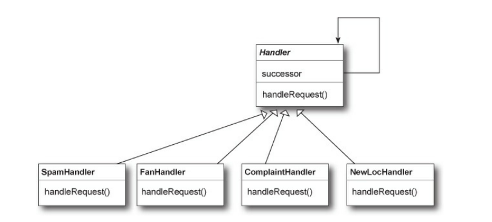

# Chain of responsibility

### Como funciona?

Se crea una cadena de objetos para examinar peticiones (**request**). A su vez cada objeto examina la peticion (**request**) y o bien la soluciona o bien se la pasa al siguiente objeto que sigue en la cadena.

> **_Observacion_**:
> Cada objeto de la cadena actua como un **handler** y tiene un objeto **sucesor**. En caso de que pueda resolver la peticion (request) la resuelve, caso contrario se la pasa al siguiente sucesor.

### Beneficios

- Desacopla al emisor (**sender**) de sus receptores (**receivers**).
- SImplifica al objeto emisor ya que no tiene que saber de la cadena y tener referencias directas a cada miembro de ella
- Permite agregar o quitar responsabilidades dinamicamente al cambiar el orden de los miembros de la cadena.

### Donde se usa? Que contras trae?

- Se usa comunmente en interfaces graficas para gestionar (**handle**) eventos como clicks del mouse o eventos del teclado.
- La ejecuccion de las peticiones no esta garantizada, ya que puede pasar toda la cadena y ningun objeto de ella la pueda resolver.
- Puede ser dificil de observar y debuggear en **runtime**.

### Cuando se usa?

Cuando se quiere dar la oportunidad a mas de un objeto de gestionar/solucionar (handle) una petición (request).

# SchedulerExecuterService

Por defecto, el **framework Executor** proporciona la clase **ThreadPoolExecutor** para ejecutar tareas de tipo **Callable** y **Runnable** con un conjunto de hilos, lo que nos ayuda a evitar todo el código repetitivo de creación de hilos. Cuando enviamos una tarea al executor, se ejecuta lo antes posible, según la configuración del executor.

Pero cuando no estamos interesados en ejecutar una tarea lo antes posible y queremos **ejecutarla después de un período de tiempo o hacerlo de manera periódica**, podemos usar la interfaz **ScheduledExecutorService** junto con su implementación, la clase **ScheduledThreadPoolExecutor**.

### FixedRate()

Cuando usamos el metodo **scheduleWithFixedRate()** la ejecuccion de la tarea empieza con un delay fijo de tiempo. No considera si hay tareas previas que sigan corriendo o no.

### Runnable

Es una interfaz en java que representa uan tarea que puede ser ejecutada por un hilo (**thread**). Tiene solo un metodo **run()** que contiene el codigo que define la tarea a realizar.

Se usa para definir tareas que puedan correr en paralelo o en diferentes hilos. (**threads**)

https://howtodoinjava.com/java/multi-threading/scheduledexecutorservice/
